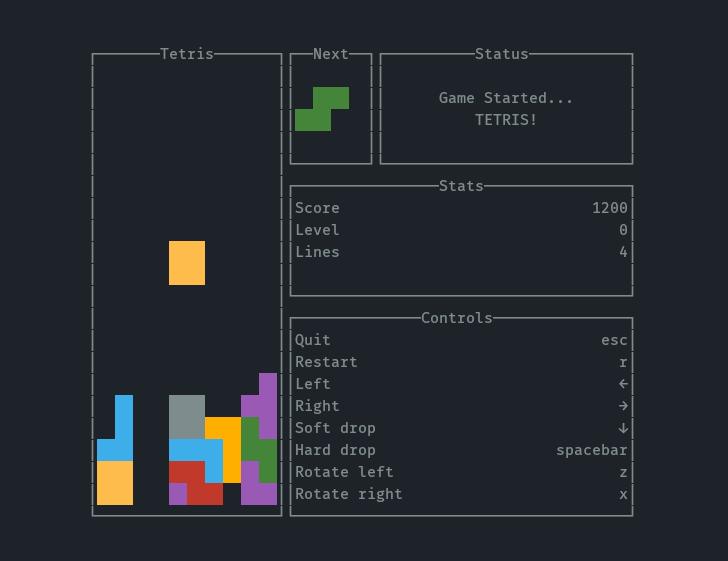

# go-tetromino

Play tetris in the terminal! This project is my rendition of tetris, which is a mix of classic tetris and modern tetris.



Note that this rendition follows the old classic tetris rotation system and not the modern super rotation system, so no fancy spins can be done.

Although, many modern features are present, like hard drop, left (anti-clockwise) and right (clockwise) rotation, as well as the ghost tetromino.

## How to run the game

Run the game via the command below from the root directory of this repo. Make sure to install Go by following instructions [here](https://go.dev/doc/install) before running the command.

```sh
go run ./cmd/go-tetromino/main.go
```
